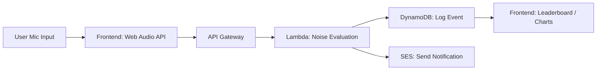

# 🔇 Silent Signal – Real-Time Ambient Noise Monitor for Remote Teams

Silent Signal is a serverless tool that helps remote teams detect and reduce disruptive background noise during virtual meetings. Built with AWS Lambda and the Web Audio API, it captures ambient mic data, identifies noisy moments, and gently nudges users to take action — improving focus and meeting quality.

---

## 🚀 Features

- 🎙️ **Live Mic Monitoring** – Captures audio levels in the browser using the Web Audio API
- 🧠 **Real-Time Noise Detection** – Sends noise metrics to a Lambda API for processing
- 📊 **Noise Logging** – Tracks noisy moments per user and call in DynamoDB
- 📩 **Smart Alerts** – Notifies users via email when ambient noise exceeds thresholds
- 📈 **Team Leaderboard** – Ranks users based on noise levels ("quietest teammate")
- 🌍 **Geo-Based Insights** – Optional location-based noise analytics
- 🤖 **AI Noise Classification** (optional) – Detects noise types (e.g. dog, traffic) using Amazon Bedrock

---

## 📸 Demo

🎥 [Watch the 3-minute video demo on YouTube](#)  
*TODO: VIDEO LINK UPLOAD*

---

## 🧩 Architecture Overview

| Component             | Tech Used                         |
|----------------------|-----------------------------------|
| Frontend             | React, Web Audio API              |
| API Gateway          | AWS API Gateway                   |
| Processing Logic     | AWS Lambda (Node.js or Python)    |
| Data Storage         | Amazon DynamoDB                   |
| Notifications        | Amazon SES / SNS                  |
| Optional AI Analysis | Amazon Bedrock                    |

